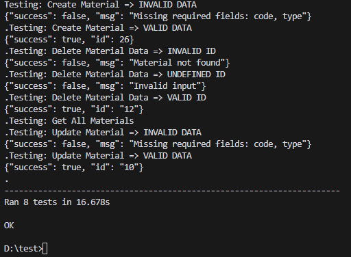

# Keda Tech Technical Test
- Odoo 14 Clone from official odoo github
- --depth 1
- --branch 14.0

## General Notes
- To sort by type just insert **sort** parameters in url (eg. http://localhost/materials?sort=fabric)

- **keda_autotesting.py** Is testing endpoints with Python Requests

- **keda_rawtesting.py** Is testing endpoints with Python Requests + Unittest
### Important
- **Adjust For Every VALID ID** both in raw testing and unittesting

Both method is works.
### Usage
```bash
python3 keda_autotesting.py
```
or
```bash
python3 keda_rawtesting.py
```

### Snippet from keda_autotesting.py
